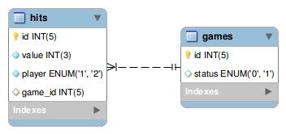

# game_of_three


### installation guide :- 

```sudo docker-compose build```

```sudo docker-compose up -d```

```sudo docker-compose exec php bash```

```composer update```

```exit```

##### add this url to your machine hosts 

```game.dev```


##### create working database 

```CREATE SCHEMA `game_of_three` DEFAULT CHARACTER SET utf8 ;```


##### create testinging database 

```CREATE SCHEMA `game_of_three_test` DEFAULT CHARACTER SET utf8 ;```

##### db diagram




##### run migration 

```sudo docker-compose exec php bash```

```php yii migrate```

```exit```


##### running the unit test

```codecept run unit```

### How to play

- for player 1 the enrty url ```http://game.dev/start?player=1``` - click start, this will create new game and first hit for player1 with random number
- it will be redirect to url ```http://game.dev/hit?player=1&id=1``` and player 1 can't add new hit
- the player 2 add new hit from this url ```http://game.dev/hit?player=2&id=1```
- then player 1 can add new hit from his url  ```http://game.dev/hit?player=1&id=1```
- and so on

